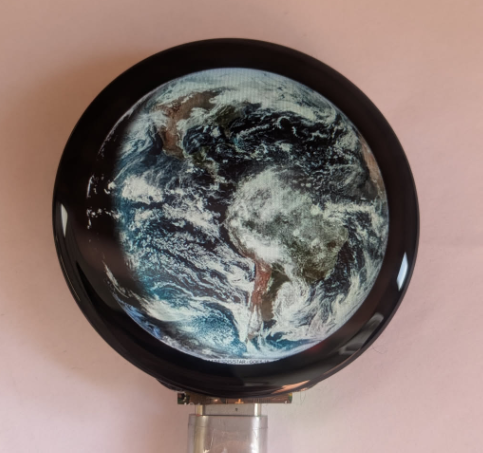
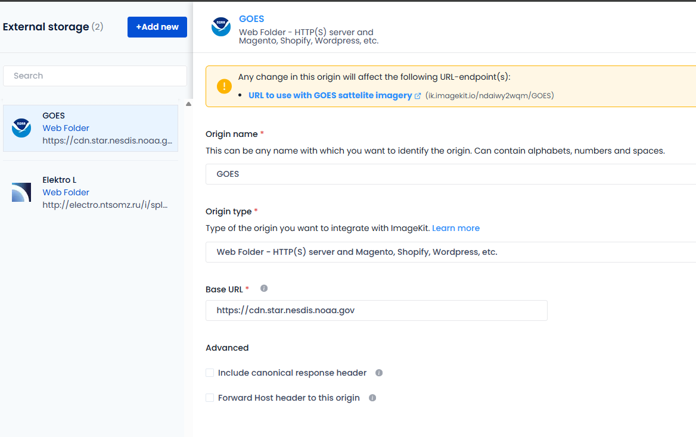
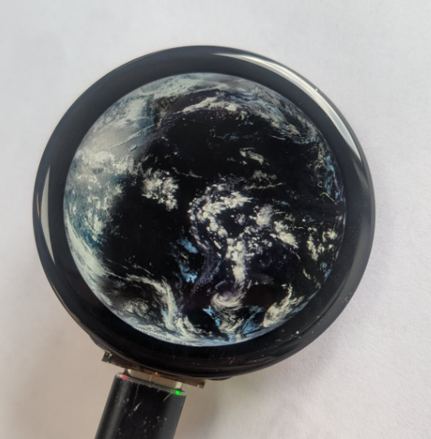

## FlatEarth

FlatEarth is an ESP32 project that displays real-time satellite imagery of Earth on a small round LCD. It fetches full-disk images from NOAA's GOES satellites (or the Russian Elektro-L), caches them in flash storage, and loops through the last 24 hours as a smooth animation — turning a desk ornament into a live window to space.



---

## How It Works

```
NOAA CDN ──► ImageKit.io (resize) ──► ESP32 (download + cache) ──► Round LCD
```

1. **Image proxy** — Raw GOES images are up to 5424×5424 pixels — far too large for an ESP32. [ImageKit.io](https://imagekit.io/) acts as a resize proxy: the ESP32 requests a URL that includes the target dimensions and quality (`tr:w-240,h-240,q-70`), and ImageKit returns a small JPEG on the fly.

2. **Download** — `ImageDownloader` constructs the URL from the current UTC time (snapped to the satellite's update cadence, minus a ~15 minute processing lag), opens an HTTP connection, and streams the JPEG into a heap-allocated buffer.

3. **Cache** — `ImageCache` stores every downloaded frame on LittleFS (`/cache/<timestamp>.jpg`). On the next animation pass, cached frames are loaded directly from flash without any network request. The oldest frame is evicted only when flash reaches 99% full, so the full 24-hour window survives across reboots.

4. **Decode & display** — `TJpg_Decoder` decodes the JPEG tile-by-tile and passes each 16×16 RGB565 block to the `tft_output()` callback, which forwards it to the display driver (`Arduino_GFX`).

5. **Animation** — After drawing the latest frame, `showLastXHours()` steps forward through all 144 timestamps (one per 10-minute GOES update) from 24 hours ago to now, drawing each frame in sequence.

### Satellite sources

| Source | Cadence | Frames / 24 h | Set `SATTYPE` to |
|---|---|---|---|
| GOES-19 East | 10 min | 144 | `GOES_EAST` |
| GOES-18 West | 10 min | 144 | `GOES_WEST` |
| Elektro-L | 30 min | 48 | `ELEKTROL` |

---

## Supported Hardware

| Board | Display | Driver | Resolution |
|---|---|---|---|
| [Waveshare ESP32-S3-Touch-LCD-1.46B](https://www.waveshare.com/wiki/ESP32-S3-Touch-LCD-1.46B) | SPD2010 (QSPI) | Arduino_GFX | 412×412 |
| Generic ESP32 DevKit | [GC9A01 1.28" round LCD (AliExpress)](https://nl.aliexpress.com/item/1005008848200231.html) (SPI) | Arduino_GFX | 240×240 |

Both boards use the same source code; the active board is selected at compile time via the PlatformIO environment (`-e upesy_wroom` or `-e waveshare_esp32_s3_touch_lcd_1_46`).

---

## Setup

### 1. ImageKit.io proxy

1. Create a free account on [ImageKit.io](https://imagekit.io/).
2. Go to **External Storage → Add New**.
3. Set **Origin Type** to `Web Folder` and **Base URL** to `https://cdn.star.nesdis.noaa.gov`.
4. Note your **URL endpoint** (e.g. `https://ik.imagekit.io/your_id/`).



### 2. Secrets file

Copy `include/renameto_secrets.h` to `include/secrets.h` and fill in your values:

```cpp
#define IMAGEKIT_ENDPOINT "https://ik.imagekit.io/your_id/"

#define WIFI_SSID1     "PrimaryNetwork"
#define WIFI_PASSWORD1 "PrimaryPassword"
#define WIFI_SSID2     "BackupNetwork"      // fallback if primary is unreachable
#define WIFI_PASSWORD2 "BackupPassword"
```

### 3. Build & flash

PlatformIO is required. Run from the project root:

```bash
# Build
~/.platformio/penv/Scripts/platformio.exe run -e upesy_wroom
~/.platformio/penv/Scripts/platformio.exe run -e waveshare_esp32_s3_touch_lcd_1_46

# Build + upload
~/.platformio/penv/Scripts/platformio.exe run -e upesy_wroom -t upload
~/.platformio/penv/Scripts/platformio.exe run -e waveshare_esp32_s3_touch_lcd_1_46 -t upload

# Serial monitor (115200 baud)
~/.platformio/penv/Scripts/platformio.exe device monitor -e upesy_wroom
```

If a build fails after switching PlatformIO versions, delete `.pio/build/<env>/` and rebuild.

---

## Configuration

All tuneable settings are in `include/config.h`. The most commonly changed ones:

| Setting | Default | Description |
|---|---|---|
| `SATTYPE` | `GOES_EAST` | Active satellite source (`GOES_EAST`, `GOES_WEST`, `ELEKTROL`) |
| `JPEG_QUALITY` | `70` | ImageKit resize quality (1–100). Lower = smaller files. |
| `UPDATE_INTERVAL_MS` | `10000` | Pause between loop iterations (ms) |
| `SERVER_LAG_MINUTES` | `15` | Processing delay subtracted from current time when fetching the latest image |
| `CACHE_FILL_THRESHOLD` | `0.99` | Fraction of LittleFS used before the oldest frame is evicted |
| `DEBUG_ENABLED` | `true` | Set `false` to silence all Serial output |

When changing `SATTYPE`, also update `NROFIMAGESTOSHOW` and `RESIZEURL` in `config.h` to match.

---

## Media



---

## To-Do

- [ ] Complete Meteosat (EUMETSAT) integration for Europe/Africa coverage
- [ ] On-device JPEG resizing to remove the ImageKit dependency
- [ ] SD card support for larger image caches
- [ ] Touch input to switch satellite source at runtime (Waveshare board)

---

> Developed with assistance from Claude (Anthropic). Hardware integration, concept, and overall direction by [@ruudrd](https://github.com/ruudrd).
